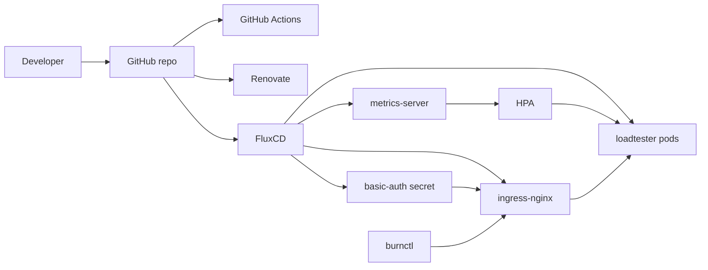

# MLOps Platform Assignment

A local GitOps platform.
Deploys a CPU-burning workload on Kubernetes using FluxCD for GitOps reconciliation,
ingress-nginx for routing with HTTP Basic Auth protected by SOPS-encrypted secrets,
and an HPA autoscaler validated by a purpose-built load testing CLI.

[](https://github.com/daviDpaD18/mlops-platform-assignment/actions/workflows/validate.yaml)


## Setup

All cluster operations, Flux lifecycle commands, and load testing are wrapped in a 
[Taskfile](https://taskfile.dev) — an alternative to Makefiles that makes the 
entire platform reproducible with short, self-documenting commands. Run `task --list` to see 
all available commands. After copying the repo be carefull to update your GITHUB_USER in the Taskfile.

```bash
task --list
```

```
cluster:up        Create local k3d cluster
cluster:down      Delete local k3d cluster
cluster:reset     Kill cluster and rebuild it from scratch
flux:bootstrap    Bootstrap FluxCD from this repo
flux:reconcile    Force immediate Flux sync across layers
flux:status       Check Flux reconciliation status
validate          Run CI checks locally before pushing
status            Full platform health check
test:endpoints    Validate auth and routing end to end
burnctl:reset     Scale to 1 pod for a clean load test baseline
burnctl:run       Run load test (pass args with --)
sops:setup        Generate age keypair and configure SOPS
sops:secret:apply Push age private key to cluster for SOPS decryption
```

### Prerequisites

| Tool | Purpose | Install (macOS) | Install (Linux / Ubuntu) |
|------|---------|-----------------|--------------------------|
| [Docker](https://docs.docker.com/get-docker/) | Container runtime for k3d | `brew install --cask docker` | `curl -fsSL https://get.docker.com \| sh` |
| [k3d](https://k3d.io) | Local Kubernetes cluster | `brew install k3d` | `curl -s https://raw.githubusercontent.com/k3d-io/k3d/main/install.sh \| bash` |
| [kubectl](https://kubernetes.io/docs/tasks/tools/) | Kubernetes CLI | `brew install kubectl` | `sudo snap install kubectl --classic` |
| [Flux CLI](https://fluxcd.io/flux/installation/) | GitOps operator | `brew install fluxcd/tap/flux` | `curl -s https://fluxcd.io/install.sh \| sudo bash` |
| [Taskfile](https://taskfile.dev) | Task runner | `brew install go-task` | `sh -c "$(curl --location https://taskfile.dev/install.sh)" -- -d -b /usr/local/bin` |
| [age](https://age-encryption.org) | Encryption for SOPS | `brew install age` | `sudo apt install age` |
| [SOPS](https://getsops.io) | Secret encryption | `brew install sops` | Download binary from [GitHub Releases](https://github.com/getsops/sops/releases) |

### Bootstrap

**1. Create the cluster:**
```bash
task cluster:up
```

**2. Bootstrap FluxCD** (requires a GitHub personal access token with `repo` scope exported as `GITHUB_TOKEN`):
```bash
task flux:bootstrap
```

**3. Apply the SOPS age private key** so Flux can decrypt the basic-auth secret:
```bash
kubectl create secret generic sops-age \
  --namespace=flux-system \
  --from-file=age.agekey=age.key
```

**4. Verify everything is healthy:**
```bash
task status
```

Flux reconciles all infrastructure and application manifests automatically within a few minutes. No manual `kubectl apply` is needed after bootstrap.

### Run the load test

```bash
task burnctl:reset   # scale to 1 pod for a clean baseline
task burnctl:run -- --duration 120 --concurrency 15
```

A PNG chart is saved to `burnctl/results/` after each run.

### Validate endpoints manually

```bash
task test:endpoints
```

### Tear down

```bash
task cluster:down
```
## Architecture



## Workflow

The repository acts as the source of truth.
After inital Flux bootstrap Flux CD pools the repository every 5 minutes and reconciles
any drift between Git and what the cluster is running, so no manual `kubectl apply` is needed.

The repository is split into 2 layers. The `infrasturcture` folder contains the platform components
deployed as Helm charts - ingress-nginx for routing and HTTP Basic Auth, and metrics-server 
for resource monitoring. The `apps` folder has the loadtester workload as Kubernetes manifests (Deployment,
Service, Ingress, HPA, and encrypted Secret). FluxCD deploys the `infrastructure` layer first using a 
`dependsOn` constraint, because I want the ingress controller ready before the application manifests are applied.

The HTTP Basic Auth credentials are never stored in plaintext. The htpasswd-encoded 
secret is encrypted with SOPS and age before being committed to the public repository. 
Flux decrypts it automatically at reconciliation time using the age private key stored 
as a Kubernetes Secret in the cluster — the only piece of state that lives outside Git.

The Horizontal Pod Autoscaler watches both CPU and memory utilization across the 
loadtester pods. When the `/burn` endpoint is hit with concurrent requests, CPU 
climbs past the 50% threshold and the HPA scales the Deployment from 1 up to 5 
replicas. Once load drops and the stabilization window expires, it scales back down.

Every pull request runs through a three-job CI pipeline: yamllint validates manifest 
syntax, flux-local renders the full Flux object tree including HelmReleases, and a 
diff job posts a comment showing exactly what would change in the cluster if the PR 
were merged. Branch protection prevents anything from reaching `main` — and therefore 
Flux — unless all checks pass. Renovate runs automatically to keep Helm chart versions 
and GitHub Actions versions up to date, opening PRs that go through the same pipeline.

## Technical choices

### Local cluster — k3d

k3d spins up a production-grade Kubernetes API inside Docker containers in under 30 
seconds, and maps host ports directly to the load balancer — meaning `curl 
http://loadtester.localhost` works from the local machine without any additional 
tunneling. Traefik and the built-in metrics-server are explicitly disabled at cluster 
creation to avoid naming conflicts with the platform components deployed through Flux.


### Ingress controller — ingress-nginx

ingress-nginx was chosen over Traefik and Envoy for two reasons. First, it supports 
HTTP Basic Auth natively via ingress annotations without requiring any middleware 
configuration. Second, k3d ships Traefik 
by default and both controllers fight for port 80, requiring one to be disabled; 
since we needed ingress-nginx's annotation-based auth, Traefik was disabled at 
cluster creation instead. Envoy and the Gateway API  add 
unnecessary complexity for a single-service local deployment.

### Secret management — SOPS + age

HTTP Basic Auth requires storing an htpasswd-encoded credential somewhere the 
ingress controller can read it.  `kubectl create secret`
keeps the credential outside Git entirely, meaning the cluster cannot be 
reproduced from the repository alone. SOPS with age encryption solves this: the 
secret manifest is encrypted before being committed, making it safe to store in a 
public repository, while Flux decrypts it automatically at reconciliation time 
using the age private key stored as a Kubernetes Secret. The only piece of state 
that lives outside Git is the age private key itself — an intentional and 
documented limitation.

### Autoscaler — HPA

The Horizontal Pod Autoscaler was chosen over VPA and KEDA because the scaling 
signal — CPU load generated by the `/burn` endpoint — is synchronous and directly 
tied to replica count. Adding more pods genuinely distributes the load, making HPA 
the correct tool. Both CPU and memory are configured as metrics, 
with CPU as the dominant trigger for this workload.

### HPA thresholds

The CPU request is set to `100m` with a limit of `500m`. The HPA target of 50% 
means scaling triggers when average CPU crosses `50m` — a deliberately low threshold 
chosen to make the autoscaling event visible and fast during demo. 

### CI pipeline — GitHub Actions with flux-local

The validation pipeline runs three jobs in sequence. yamllint catches syntax errors 
before anything else runs. flux-local renders the full Flux object tree including 
HelmReleases with `--enable-helm`, validating that every chart reference and 
Kustomization resolves correctly without a live cluster. On pull requests a third 
job runs flux-local diff and posts the rendered output as a PR comment, showing 
exactly what would change in the cluster before any code is merged. Branch 
protection ensures that no manifest can reach `main`.

### Dependency updates — Renovate

Renovate is configured to watch Helm chart versions in HelmRelease manifests and 
GitHub Actions versions in workflow files. It opens pull requests automatically 
when newer versions are available, each of which goes through the full CI pipeline 
before being merged. 

## Load testing — burnctl

`burnctl` is a purpose-built Python CLI that drives authenticated concurrent load 
against the `/burn` endpoint, monitors the cluster's response, and produces a 
summary report with a chart. It lives in `burnctl/main.py` and is invoked via 
Taskfile.

### How it works

`burnctl` spawns N concurrent async workers that continuously fire authenticated 
requests to `/burn` for the duration of the test — no batching, no idle time between 
requests. A separate watcher task runs in parallel, polling `kubectl get pods` and 
`kubectl top pods` every 5 seconds to track pod count changes and collect CPU/memory 
samples across all running replicas. At the end of the run it prints a summary of 
request outcomes, latency percentiles, resource averages, peak pod count, and the 
timestamp when the HPA first scaled out. A PNG chart is generated automatically 
showing all four metrics over time.

### The 409 behavior

The `/burn` endpoint is synchronous and single-threaded per pod — it accepts one 
burn request at a time and returns 409 `{"status":"already burning"}` for any 
concurrent request that hits a pod already under load. This is expected and 
intentional: the 409s prove that pods are saturated and the HPA is being given 
a genuine reason to scale. The summary explicitly separates 202 responses 
(pods that accepted a new burn) from 409s (pods already at capacity) so the 
output reads as a deliberate platform observation rather than an error condition.

### Running it

```bash
task burnctl:reset                                    # scale to 1 pod for a clean baseline
task burnctl:run -- --duration 120 --concurrency 15  # run the load test
```

A PNG chart is saved to `burnctl/results/` after each run showing pod scaling, 
CPU and memory usage, and request latency over time.

### Sample output

